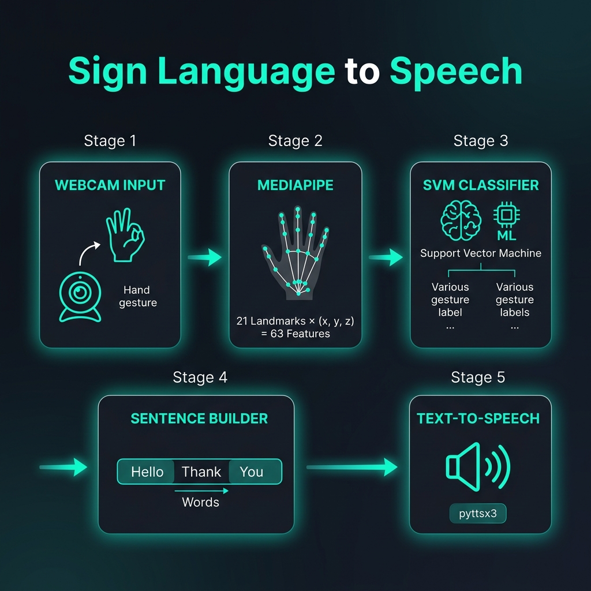
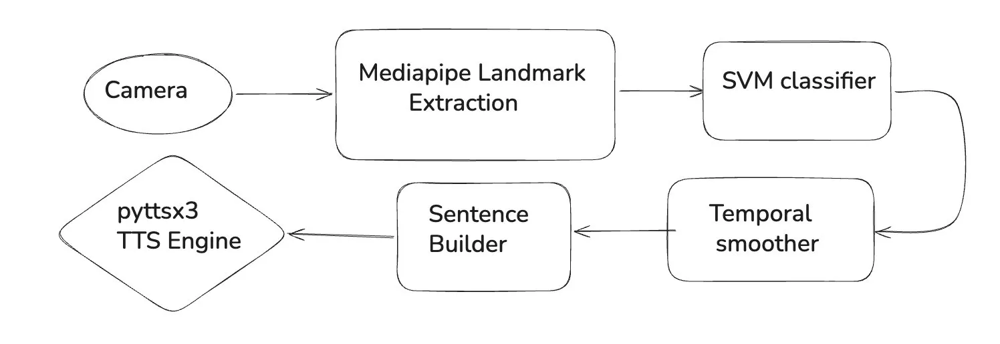
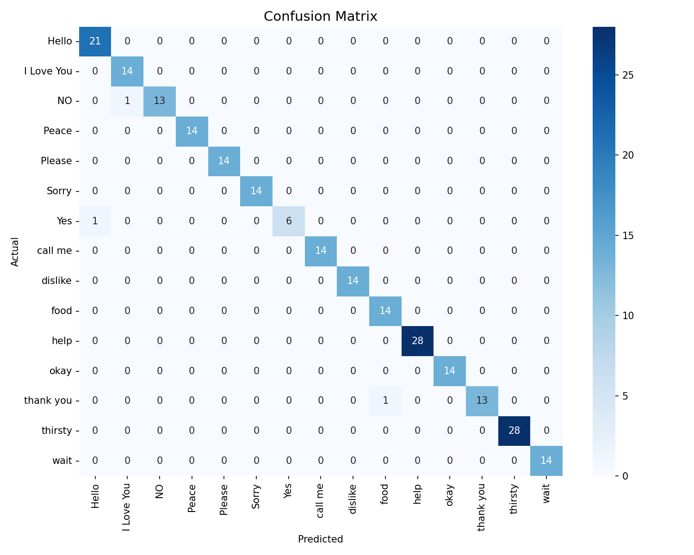

<h1 align="center">✋ Sign Language to Speech</h1>

<p align="center">
  <b>Real-Time Hand Gesture Recognition & Text-to-Speech System</b><br/>
  Translate sign language into spoken words — powered by MediaPipe, SVM & OpenCV
</p>

<p align="center">
  
  
  
  
  
</p>

---

## 📽️ Demo

<video width="100%" height="auto" controls>
  <source src="assets/Demo.mp4" type="video/mp4">
  Your browser does not support the video tag.
</video>

---

## 🧠 How It Works

<p align="center">
  
</p>

The system follows a **5-stage pipeline**:

| Stage | Component | Description |
|:-----:|-----------|-------------|
| 1 | **Webcam Input** | Captures live video frames from the camera |
| 2 | **MediaPipe Hands** | Detects 21 hand landmarks → 63 features (x, y, z per point) |
| 3 | **SVM Classifier** | Classifies the 63-feature vector into one of 16 gesture labels |
| 4 | **Sentence Builder** | Hold a gesture steady (~0.7s) to add the word to a sentence |
| 5 | **Text-to-Speech** | pyttsx3 speaks the sentence aloud in a background thread |

---

## 📊 Project Workflow

<p align="center">
  
</p>

| Phase | Script | What It Does |
|:-----:|--------|-------------|
| **1** | `dataset/collect_data.py` | Captures 70 hand-landmark samples per gesture via webcam → saves as CSV |
| **2** | `train_model.py` | Trains a linear SVM on all CSVs → saves `gesture_model.pkl` + confusion matrix |
| **3** | `realtime_prediction.py` | Loads model, runs live prediction, builds sentences, speaks them aloud |

---

## 🗂️ Project Structure

```
├── assets/
│   ├── Demo.mp4                   # Demo video of the app in action
│   ├── Block_diagram.webp         # Project workflow diagram
│   └── architecture_diagram.png   # System architecture diagram
├── dataset/
│   ├── collect_data.py            # Script to collect gesture data via webcam
│   ├── Hello.csv                  # Landmark data for each gesture
│   ├── I Love You.csv
│   ├── NO.csv
│   ├── Peace.csv
│   ├── Please.csv
│   ├── Sorry.csv
│   ├── Yes.csv
│   ├── call_me.csv
│   ├── dislike.csv
│   ├── food.csv
│   ├── help.csv
│   ├── okay.csv
│   ├── thank you.csv
│   ├── thirsty.csv
│   ├── wait.csv
│   └── you.csv
├── model/
│   ├── gesture_model.pkl          # Trained SVM model (auto-generated)
│   └── confusion_matrix.png       # Confusion matrix plot (auto-generated)
├── hand_detection_test.py         # Quick script to verify MediaPipe hand detection
├── test_camera.py                 # Quick script to verify webcam access
├── train_model.py                 # Model training & evaluation script
├── realtime_prediction.py         # Main app — real-time gesture → speech
├── requirements.txt               # Python dependencies
├── .gitignore
└── README.md
```

---

## ✅ Supported Gestures (16)

| # | Gesture | Samples | | # | Gesture | Samples |
|---|---------|--------:|-|---|---------|--------:|
| 1 | Hello | 104 | | 9 | Dislike | 70 |
| 2 | I Love You | 69 | | 10 | Food | 70 |
| 3 | NO | 69 | | 11 | Help | 140 |
| 4 | Peace | 70 | | 12 | Okay | 70 |
| 5 | Please | 69 | | 13 | Thank You | 70 |
| 6 | Sorry | 70 | | 14 | Thirsty | 140 |
| 7 | Yes | 34 | | 15 | Wait | 70 |
| 8 | Call Me | 70 | | 16 | You | 70 |

> **Total samples:** 1,255 across 16 gesture classes

---

## 🛠️ Prerequisites

| Requirement | Details |
|---|---|
| **Python** | 3.9+ (developed on 3.9.6) |
| **Webcam** | Built-in or external USB camera |
| **OS** | macOS, Linux, or Windows |

> **macOS users:** You may need to grant camera permission to your terminal/IDE the first time.

---

## 🚀 Setup & Installation

### 1. Clone the Repository

```bash
git clone https://github.com/<your-username>/sign-language-to-speech.git
cd sign-language-to-speech
```

### 2. Create a Virtual Environment

```bash
python3 -m venv venv
```

### 3. Activate the Virtual Environment

```bash
# macOS / Linux
source venv/bin/activate

# Windows
venv\Scripts\activate
```

### 4. Install Dependencies

```bash
pip install -r requirements.txt
```

---

## 🏃 Usage

### Step 0 — Verify Camera Access (Optional)

```bash
python test_camera.py
```

A window should open showing your webcam feed. Press **Q** to quit. If this doesn't work, fix your camera setup before proceeding.

### Step 1 — Collect Gesture Data

> **Skip this step** if you want to use the pre-collected dataset included in `dataset/`.

```bash
cd dataset
python collect_data.py
```

- Enter the gesture name when prompted (e.g., `Hello`).
- Perform the gesture in front of the camera — 70 samples are collected automatically.
- A CSV file is created in the `dataset/` folder.
- Repeat for each new gesture you want to add.

### Step 2 — Train the Model

```bash
python train_model.py
```

**Output:**
- Prints accuracy and a classification report to the console.
- Saves the trained model → `model/gesture_model.pkl`
- Saves a confusion matrix plot → `model/confusion_matrix.png`

### Step 3 — Run Real-Time Prediction

```bash
python realtime_prediction.py
```

**On-screen controls:**

| Key | Action |
|:---:|--------|
| **S** | Speak the built sentence aloud |
| **C** | Clear the sentence |
| **B** | Backspace (remove last word) |
| **Q** | Quit the application |

**How sentence building works:**
- Hold a gesture steady for ~0.7 seconds (20 frames) and it gets added to the sentence.
- A progress bar shows how close you are to adding the gesture.
- The same gesture won't be added twice in a row — switch to a different gesture or remove your hand and re-sign.

---

## 🔬 Technical Details

### Feature Extraction

- **MediaPipe Hands** detects 21 hand landmarks, each with `(x, y, z)` coordinates.
- This yields a **63-dimensional feature vector** per frame.

### Classification

- **Algorithm:** Support Vector Machine (SVM) with a linear kernel.
- **Library:** Scikit-Learn (`sklearn.svm.SVC`)
- `probability=True` enables confidence scores displayed as a live bar in the UI.

### Prediction Smoothing

- A **rolling buffer of 10 predictions** is used; the most frequent label (mode) is taken as the final prediction, reducing jitter.

### Text-to-Speech

- **pyttsx3** is used for offline TTS (no internet needed).
- Speech runs in a **background thread** so the video feed doesn't freeze.

### Model Evaluation

<p align="center">
  
</p>

> The confusion matrix above is auto-generated during training (`train_model.py`). It shows per-gesture classification accuracy across the test set.

---

## ➕ Adding New Gestures

1. Run the data collection script:
   ```bash
   cd dataset
   python collect_data.py
   ```
2. Enter a descriptive gesture name (this becomes the label).
3. Perform the gesture — 70 samples are auto-captured.
4. Re-train the model:
   ```bash
   cd ..
   python train_model.py
   ```
5. Run the prediction script — your new gesture is now recognized.

---

## 🧰 Tech Stack

| Component | Technology |
|---|---|
| Hand Detection | [MediaPipe](https://mediapipe.dev/) |
| ML Model | [Scikit-Learn](https://scikit-learn.org/) — SVM |
| Computer Vision | [OpenCV](https://opencv.org/) |
| Text-to-Speech | [pyttsx3](https://pyttsx3.readthedocs.io/) |
| Data Processing | [Pandas](https://pandas.pydata.org/), [NumPy](https://numpy.org/) |
| Visualization | [Matplotlib](https://matplotlib.org/), [Seaborn](https://seaborn.pydata.org/) |

---

## 🐛 Troubleshooting

| Issue | Solution |
|---|---|
| **Camera not opening** | Run `python test_camera.py` to verify. On macOS, grant camera permission to your terminal app. |
| **ModuleNotFoundError** | Make sure the virtual environment is activated and run `pip install -r requirements.txt`. |
| **Low accuracy** | Collect more samples per gesture, ensure good lighting, and keep a clean background. |
| **TTS not working** | On Linux, install `espeak`: `sudo apt install espeak`. On macOS/Windows, pyttsx3 uses native engines. |
| **MediaPipe install fails** | Ensure Python ≤ 3.12. MediaPipe may not support the latest Python version yet. |

---

## 📄 License

This project is open-source and available for educational and personal use.

---

## 🤝 Contributing

Contributions are welcome! Feel free to:
- Add new gestures to the dataset
- Improve the UI/UX of the prediction window
- Experiment with different ML models (Random Forest, Neural Networks)
- Add support for two-handed gestures

---

## 👤 Author

**Sumit Sourabh**

---

> ⭐ If you found this project useful, give it a star on GitHub!
